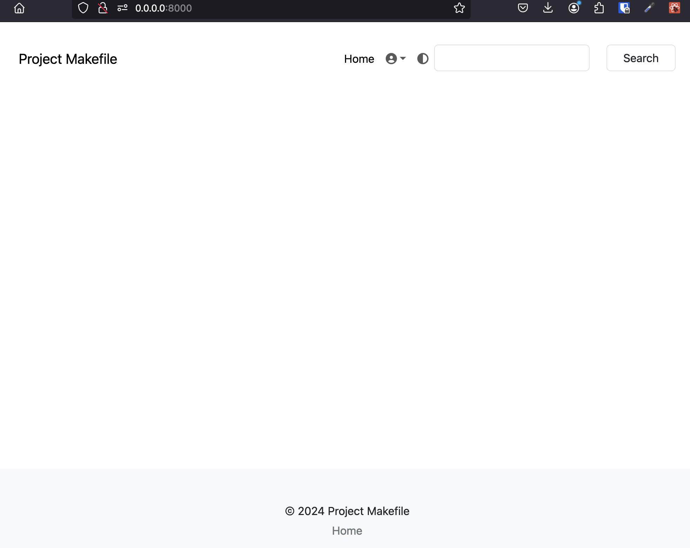
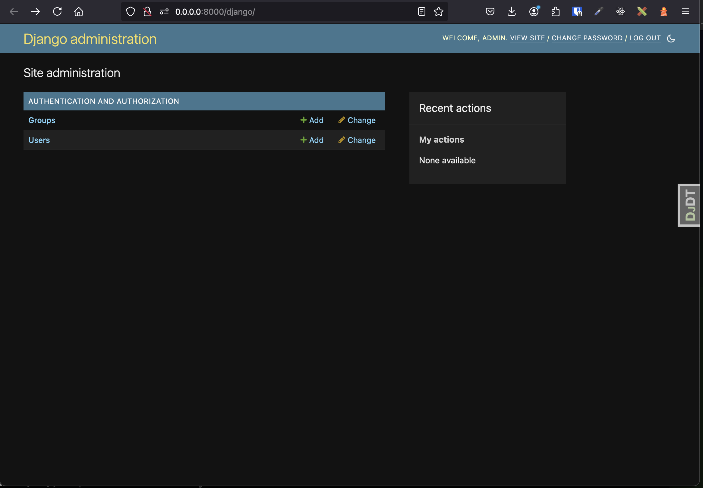

# Testing Django with MongoDB 

- Via https://github.com/aclark4life/django-mongodb

# WIP

- [Add](https://github.com/aclark4life/django-mongodb/commit/4bde24a7e208bc582eab54a0cdc672d2473f1d45) and [use](https://github.com/aclark4life/test-django-mongodb/blob/main/backend/settings/base.py#L144) setting to disable Django version check.

- Latest Django
    - webpack-boilerplate
    - django-debug-toolbar

- [Automate setup](https://github.com/aclark4life/test-django-mongodb/blob/main/project.mk#L61-L79)
    - Custom admin
    - Custom migrations

# Screenshots

